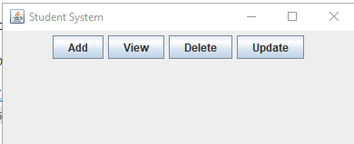
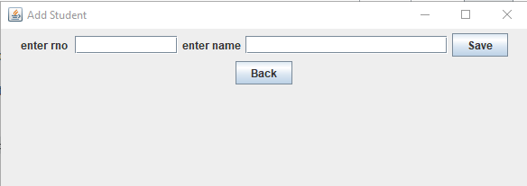
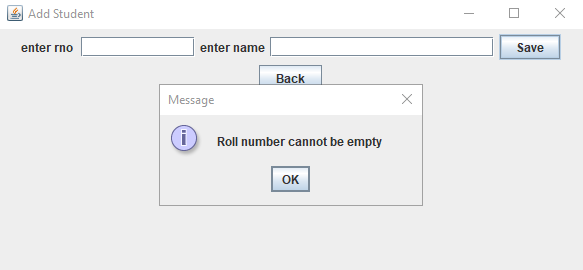
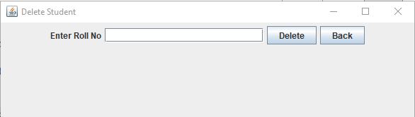

# Student-Management-Java
Basic student management GUI created in java with MySQL connectivity and basic CRUD operations. 
 
**Steps to run project** 
<ul>
  <li>Create a table with name 'student'</li>
  <li>Go to the root directory and open terminal</li>
  <li>Run following commands:  javac -cp ojdbc14.jar *.java  java -cp ojdbc14.jar ;. MainFrame</li>
</ul>

<h3>Screenshots</h3>

